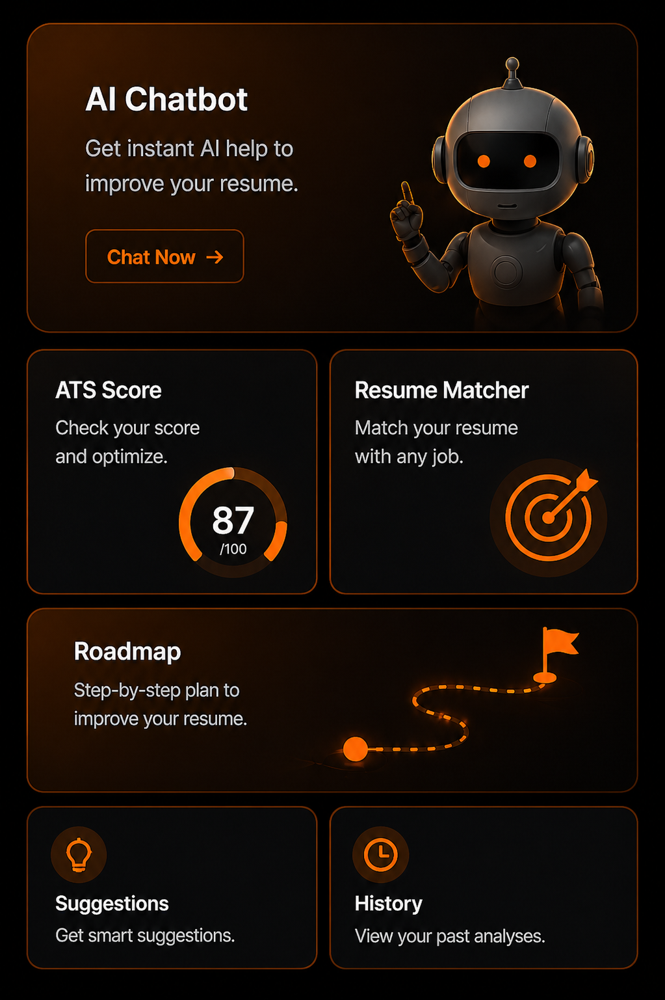

# 📄 Resume-AI

> **AI-Powered Resume Builder, Job Matcher, and Career Assistant**

An intelligent platform that helps the users create, optimize, and match their resumes with job opportunities using advanced AI capabilities.

---

## ✨ Features

- 🤖 **AI Resume Analysis** - Intelligent resume parsing and improvement suggestions
- 💼 **Job Matching** - Smart matching between resumes and job descriptions
- ✏️ **Resume Editor** - Modern, user-friendly resume builder with live preview
- 📊 **Career Analytics** - Track skills, experience, and career progression
- 🎨 **Beautiful UI** - Responsive design with Shadcn/UI components
- 📱 **Mobile Friendly** - Works seamlessly across all devices
- 🔐 **Secure** - JWT authentication and encrypted data storage
- 🌍 **Multi-language Support** - Global reach with internationalization

---

## 🛠️ Tech Stack

### Frontend
- **React 18.3** - Modern UI framework
- **TypeScript** - Type-safe development
- **Vite** - Lightning-fast build tool
- **Tailwind CSS** - Utility-first styling
- **Shadcn/UI** - Beautiful component library
- **React Router** - Client-side routing
- **Framer Motion** - Smooth animations
- **React Hook Form** - Form state management
- **TanStack Query** - Data fetching & caching
- **Chart.js** - Data visualization

### Backend
- **FastAPI** - Modern Python web framework
- **SQLAlchemy 2.0** - ORM for database
- **MySQL** - Relational database
- **Alembic** - Database migrations
- **Google Gemini API** - AI-powered resume analysis
- **xAI Grok** - Alternative AI processing
- **spaCy** - NLP processing
- **Sentence-BERT** - Semantic similarity

### Tools & DevOps
- **Vitest** - Unit testing
- **ESLint** - Code quality
- **PostCSS** - CSS processing
- **Vercel** - Deployment platform

---

## 📋 Project Structure

```
Resume-AI/
├── src/                          # Frontend source code
│   ├── components/              # Reusable React components
│   ├── pages/                   # Page components
│   ├── hooks/                   # Custom React hooks
│   ├── services/                # API services
│   ├── utils/                   # Utility functions
│   ├── types/                   # TypeScript type definitions
│   └── App.tsx                  # Main app component
├── backend/                     # FastAPI backend
│   ├── app/
│   │   ├── main.py             # FastAPI app entry point
│   │   ├── config.py           # Configuration (env vars)
│   │   ├── database.py         # SQLAlchemy setup
│   │   ├── models/             # Database models
│   │   ├── schemas/            # Request/response schemas
│   │   ├── routers/            # API routes
│   │   ├── services/           # Business logic
│   │   └── utils/              # Helper functions
│   └── requirements.txt         # Python dependencies
├── public/                      # Static assets
├── index.html                   # HTML entry point
├── tailwind.config.ts           # Tailwind configuration
├── vite.config.ts               # Vite configuration
└── package.json                 # NPM dependencies
```

---

## 🚀 Getting Started

### Prerequisites
- **Node.js** 18+ & npm/bun
- **Python** 3.9+
- **MySQL** 8.0+
- **Git**

### Frontend Setup

1. **Clone the repository**
```bash
git clone https://github.com/urshitaa/Resume-AI.git
cd Resume-AI
```

2. **Install dependencies**
```bash
npm install
# or using bun
bun install
```

3. **Configure environment**
```bash
cp .env.example .env
# Edit .env with your configuration
```

4. **Start development server**
```bash
npm run dev
# Application will be available at http://localhost:5173
```

5. **Build for production**
```bash
npm run build
npm run preview
```

### Backend Setup

1. **Navigate to backend**
```bash
cd backend
```

2. **Create virtual environment**
```bash
python -m venv venv
source venv/bin/activate        # Windows: venv\Scripts\activate
```

3. **Install dependencies**
```bash
pip install -r requirements.txt
```

4. **Setup database**
```bash
# Create MySQL database
mysql -u root -p
CREATE DATABASE resumeai CHARACTER SET utf8mb4 COLLATE utf8mb4_unicode_ci;
```

5. **Configure environment**
```bash
cp .env.example .env
# Edit .env with your API keys and database credentials
```

6. **Run migrations** (if using Alembic)
```bash
alembic upgrade head
```

7. **Start server**
```bash
uvicorn app.main:app --reload --port 8000
```

Access API documentation at `http://localhost:8000/docs`

---

## 📝 Available Scripts

### Frontend
```bash
npm run dev              # Start development server
npm run build            # Build for production
npm run build:dev        # Development build
npm run preview          # Preview production build
npm run lint             # Run ESLint
npm run test             # Run tests once
npm run test:watch       # Run tests in watch mode
```

### Backend
```bash
# From backend directory
uvicorn app.main:app --reload          # Start dev server
alembic revision --autogenerate        # Create migration
alembic upgrade head                   # Apply migrations
pytest                                 # Run tests
```

---

## 🔑 Environment Variables

### Frontend (.env)
```env
VITE_API_URL=http://localhost:8000
VITE_APP_NAME=Resume-AI
```

### Backend (.env)
```env
# Database
DB_HOST=localhost
DB_PORT=3306
DB_USER=root
DB_PASSWORD=your_password
DB_NAME=resumeai

# Security
SECRET_KEY=your_secret_key_here
ALGORITHM=HS256
ACCESS_TOKEN_EXPIRE_MINUTES=60

# APIs
GEMINI_API_KEY=your_gemini_key
GROK_API_KEY=your_grok_key

# Upload
UPLOAD_DIR=./uploads
MAX_FILE_SIZE=5242880  # 5MB

# CORS
ALLOWED_ORIGINS=http://localhost:5173,http://localhost:3000
```

---

## 🧪 Testing

### Frontend
```bash
npm run test              # Run all tests
npm run test:watch       # Watch mode
```

### Backend
```bash
pytest                   # Run all tests
pytest -v               # Verbose output
pytest tests/unit       # Unit tests only
```

---

## 📚 API Documentation

Once the backend is running, visit `http://localhost:8000/docs` for interactive Swagger UI documentation.

### Key Endpoints

#### Authentication
- `POST /auth/register` - Register new user
- `POST /auth/login` - User login
- `POST /auth/refresh` - Refresh token
- `POST /auth/logout` - User logout

#### Resume
- `POST /resume/upload` - Upload resume
- `GET /resume/{id}` - Get resume details
- `PUT /resume/{id}` - Update resume
- `DELETE /resume/{id}` - Delete resume
- `POST /resume/{id}/analyze` - AI analysis

#### Jobs
- `GET /jobs/search` - Search job listings
- `POST /jobs/match` - Match resume with jobs
- `GET /jobs/{id}` - Get job details

#### Career
- `GET /career/insights` - Get career analytics
- `GET /career/recommendations` - Get improvement suggestions

---

## 🎯 Key Features Explained

### Resume Analysis
Uses **Google Gemini AI** and **xAI Grok** to:
- Extract information from resume PDFs/DOCX
- Analyze resume quality and completeness
- Suggest improvements for better ATS compatibility
- Generate relevant keywords for job matching

### Job Matching
Powered by **Sentence-BERT** embeddings:
- Semantic similarity matching between resume and job descriptions
- Skill gap identification
- Salary range recommendations
- Career progression path suggestions

### Modern UI Components
- Responsive design using **Tailwind CSS**
- Accessible components from **Shadcn/UI**
- Smooth animations with **Framer Motion**
- Beautiful charts with **Chart.js**

---

## Screenshots



## 🤝 Contributing

Contributions are welcome! Here's how you can help:

1. **Fork** the repository
2. **Create** a feature branch (`git checkout -b feature/AmazingFeature`)
3. **Commit** your changes (`git commit -m 'Add AmazingFeature'`)
4. **Push** to the branch (`git push origin feature/AmazingFeature`)
5. **Open** a Pull Request

Please ensure:
- Code follows project style guidelines (ESLint/pylint)
- Tests are included for new features
- Commits follow conventional commit format
- README is updated if needed

---

## 📦 Deployment

### Frontend (Vercel)
```bash
npm run build
vercel deploy
```

### Backend (Docker recommended)
```bash
# Create Dockerfile in backend/
docker build -t resumeai-backend .
docker run -p 8000:8000 resumeai-backend
```

---

## 🐛 Bug Reports & Feature Requests

Found a bug? Have a feature idea? Please open an **Issue** on GitHub with:
- Clear description of the issue
- Steps to reproduce (for bugs)
- Expected vs actual behavior
- Screenshots if applicable
- Environment details

---

## 📄 License

This project is licensed under the MIT License - see the LICENSE file for details.

---

## 👥 Contributors

- **Urshitaa** - Project creator & maintainer

---

## 🙌 Acknowledgments

- [Shadcn/UI](https://ui.shadcn.com/) - Component library
- [Google Gemini](https://ai.google.dev/) - AI services
- [xAI Grok](https://grok.x.ai/) - AI services
- [FastAPI](https://fastapi.tiangolo.com/) - Backend framework
- [React](https://react.dev/) - Frontend framework

---

## 📞 Support

For questions or support:
- 📧 Email: urshitaachopra@gmail.com, dhirajk22410@gmail.com


---


⭐ If you find this project helpful, please star it on GitHub!
